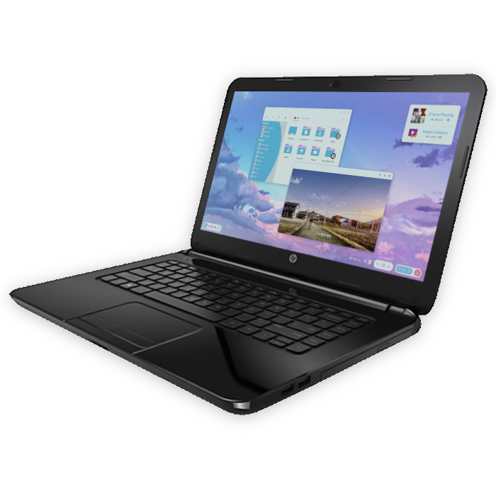

Hai, namaku **Harry Kurniawan** biasa dipanggil **Harry**. **RYK** hanyalah sebuah identitas. 
Seorang yang betah berjam-jam di depan monitor komputer hanya karena haus akan Ilmu Komputer. Terbiasa bermain dengan linux, ilustrasi/desain, jaringan komputer, serta sedikit mengenai keamanan sistem.

Tujuan dibangun dan dikembangkannya blog ini adalah sebagai arsip/catatan semua ilmu yang pernah kudapatkan melalui pengajaran di sekolah maupun otodidak.

Semoga kedepannya blog ini bermanfaat bagi saya dan orang lain. :grin:

### Follow me on

* :(fab fa-github fa-fw): [GitHub](https://github.com/owl4ce)
* :(fab fa-reddit fa-fw): [Reddit](https://reddit.com/u/owl4ce/)
* :(fab fa-facebook fa-fw): [Facebook](https://facebook.com/hrry.elrc)
* :(fab fa-instagram fa-fw): [Instagram](https://instagram.com/hrry.elrc)

### Contact
* :(fab fa-telegram fa-fw): [Telegram](https://t.me/hrry.elrc)
* :(fas fa-envelope fa-fw): [Email](mailto:hrry.elrc@protonmail.com)

### Partner
* :(fab fa-linux fa-fw): [Ibislinux](https://ibislinux.or.id)
* :(fas fa-globe fa-fw): [LinuxSec](https://linuxsec.org)


:(fas fa-server fa-fw): Hosted on [GitHub Pages](https://help.github.com/en/github/working-with-github-pages/about-github-pages)  
:(fas fa-tools fa-fw): Built with [Hugo](https://gohugo.io/)  
:(fas fa-palette fa-fw): Theme uses [LoveIt](https://hugoloveit.com)  
:(fas fa-edit fa-fw): Written with [Geany](https://www.geany.org/)  


| Items                 | Value                                                                                                     |
|-----------------------|-----------------------------------------------------------------------------------------------------------|
| Product Name          | HP 14-g102au                                                                                                 |
| Product Number        | K8U80PA                                                                                                   |
| Microprocessor        | 1.5 GHz AMD Quad-Core A4-5000 APU with Radeon HD 8330 Graphics                                            |
| Chipset               | Intel HM87 Express                                                                                        |
| Microprocessor Cache  | 2 MB cache                                                                                                |
| Memory                | 4 GB 1600 MHz DDR3L SDRAM (1 x 4 GB)                                                                      |
| Memory Slots          | 1 user-accessible                                                                                         |
| Video Graphics        | AMD Radeon HD 8330 Graphics                                                                               |
| Display               | 14" diagonal HD BrightView WLED-backlit (1366 x 768)                                                      |
| Hard Drive            | 500 GB Toshiba 5400 rpm SATA                                                                              |
| Solid State Drive     | 120 GB Adata SU650 Sequential R/W 520 / 450MB/s SATA                                                      |
| Network Card          | Integrated 10/100 BASE-T Ethernet LAN                                                                     |
| Wireless Connectivity | 802.11b/g/n (1x1) and Bluetooth 4.0 - Qualcomm Atheros AR9485                                             |
| Sound                 | Dual speakers                                                                                             |
| Keyboard              | Full-size textured island-style                                                                           |
| Pointing Device       | Touchpad with multi-touch gesture support                                                                 |
| External Ports        | 1 multi-format SD media card reader 1 USB 3.0 2 USB 2.0 1 HDMI 1 VGA 1 RJ-45 1 headphone/microphone combo |
| Dimensions            | 34.5 x 24.4 x 2.53 cm                                                                                     |
| Weight                | Starting at 1.96 kg                                                                                       |
| Power                 | 45 W AC power adapter 4-cell, 41 Wh Li-ion                                                                |
| Camera                | HP TrueVision HD Webcam (front-facing) with integrated digital microphone                                 |
