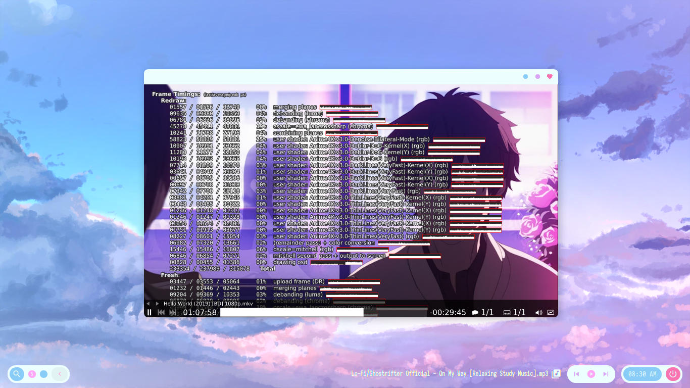

Mpv adalah media player open-source dibangun berdasarkan **MPlayer** dan **mplayer2** yang sederhana dan ringan. Mpv juga mendukung berbagai format file media, codec audio dan video, dan tipe subtitle.


Sedangkan Anime4K adalah serangkaian algoritma yang mengurangi jumlah noise secara real-time, open-source, dan berkualitas tinggi yang dapat diimplementasikan dalam bahasa pemrograman apa pun. Kesederhanaan dan kecepatan Anime4K memungkinkan pengguna untuk menonton anime yang ditingkatkan secara real time tanpa mengubah kualitas asli video.

Pada tutorial kali ini, saya menggunakan software mpv sebagai video player yang nantinya digunakan untuk mengimplementasikan shader **.glsl** kedalam video.

---

## Instalasi Paket
**:(fab fa-ubuntu fa-fw): Debian dan Ubuntu**
```bash
sudo apt install mpv
```

**:(fab fa-linux fa-fw): Arch Linux**
```bash
sudo pacman -S mpv
```

**:(fab fa-windows fa-fw): Windows** [:(fas fa-external-link-alt fa-fw):](https://sourceforge.net/projects/mpv-player-windows/files/)

---

## Instalasi Shader
Pertama, unduh file [Anime4K v3.0 :(fas fa-file-download faw):](https://github.com/bloc97/Anime4K/releases/download/3.0/Anime4K_v3.0.zip).

**:(fab fa-linux fa-fw): GNU/Linux**  
Buat direktori konfigurasi untuk mpv.
```bash
mkdir -p ~/.config/mpv/shaders
```

Kemudian, ekstrak dan salin file **.glsl** ke <u>~/.config/mpv/shaders</u>

**:(fab fa-windows fa-fw): Windows**  
Buat direktori konfigurasi untuk mpv dengan Windows Explorer.   
Kemudian, ekstrak dan salin file **.glsl** ke <u>C:\Users\user\AppData\mpv\shaders</u>

---

## Konfigurasi
Buat file **mpv.conf** dan **input.conf** didalam direktori:

**:(fab fa-linux fa-fw): GNU/Linux**: <u>~/.config/mpv</u>

**:(fab fa-windows fa-fw): Windows**: <u>C:\Users\user\AppData\mpv</u>
 
Selanjutnya konfigurasi menggunakan text editor. Berikut contoh konfigurasi dasar **mpv.conf**.
```cfg
# VIDEO
profile=gpu-hq
scale=ewa_lanczossharp
cscale=ewa_lanczossharp

# GENERAL
input-ipc-server=/tmp/mpvsocket           # listen for IPC on this socket
save-position-on-quit=no                  # handled by a script

#no-border                                # no window title bar
msg-module                                # prepend module name to log messages
msg-color                                 # color log messages on terminal
term-osd-bar                              # display a progress bar on the terminal
use-filedir-conf                          # look for additional config files in the directory of the opened file
#pause                                    # no autoplay
keep-open                                 # keep the player open when a file's end is reached
autofit-larger=90%x90%                    # resize window in case it's larger than W%xH% of the screen
cursor-autohide-fs-only                   # don't autohide the cursor in window mode, only fullscreen
input-media-keys=no                       # enable/disable OSX media keys
cursor-autohide=1000                      # autohide the curser after 1s
prefetch-playlist=yes
force-seekable=yes

screenshot-format=png
screenshot-png-compression=8
screenshot-template='~/Pictures/MPV/%F (%P) %n'

hls-bitrate=max                           # use max quality for HLS streams

[ytdl-desktop]
profile-desc=cond:is_desktop()
ytdl-format=bestvideo[height<=?720]+bestaudio/best

[ytdl-laptop]
profile-desc=cond:is_laptop()
ytdl-format=bestvideo[height<=?720][fps<=?30][vcodec!=?vp9][protocol!=http_dash_segments]+bestaudio/best

[default]

# CACHE
# Configure the cache to be really big (multiple GBs)
# We have a lot of memory, so why not use it for something

cache=no
#cache-default=4000000                    # size in KB
#cache-backbuffer=250000                  # size in KB
#demuxer-max-bytes=1147483647             # ~1 GiB in bytes

# OSD / OSC
osd-level=1                               # enable osd and display --osd-status-msg on interaction
osd-duration=2500                         # hide the osd after x ms
osd-status-msg='${time-pos} / ${duration}${?percent-pos:　(${percent-pos}%)}${?frame-drop-count:${!frame-drop-count==0:　Dropped: ${frame-drop-count}}}\n${?chapter:Chapter: ${chapter}}'

osd-font='Source Sans Pro'
osd-font-size=32
osd-color='#CCFFFFFF'                     # ARGB format
osd-border-color='#DD322640'              # ARGB format
#osd-shadow-offset=1                      # pixel width for osd text and progress bar
osd-bar-align-y=0                         # progress bar y alignment (-1 top, 0 centered, 1 bottom)
osd-border-size=2                         # size for osd text and progress bar
osd-bar-h=2                               # height of osd bar as a fractional percentage of your screen height
osd-bar-w=60                              # width of " " "

# SUBTITLES
sub-auto=all                              # detect all subtitle
no-sub-visibility                         # hidden as default
#sub-auto=fuzzy                           # external subs don't have to match the file name exactly to autoload
sub-file-paths-append=ass                 # search for external subs in these relative subdirectories
sub-file-paths-append=srt
sub-file-paths-append=sub
sub-file-paths-append=subs
sub-file-paths-append=subtitles

demuxer-mkv-subtitle-preroll              # try to correctly show embedded subs when seeking
embeddedfonts=yes                         # use embedded fonts for SSA/ASS subs
sub-fix-timing=no                         # do not try to fix gaps (which might make it worse in some cases)
sub-ass-force-style=Kerning=yes           # allows you to override style parameters of ASS scripts
sub-use-margins
sub-ass-force-margins

# the following options only apply to subtitles without own styling (i.e. not ASS but e.g. SRT)
sub-font="Source Sans Pro Semibold"
sub-font-size=36
sub-color="#FFFFFFFF"
sub-border-color="#FF262626"
sub-border-size=3.2
sub-shadow-offset=1
sub-shadow-color="#33000000"
sub-spacing=0.5

# LANGUAGES
slang=enm,en,eng,de,deu,ger               # automatically select these subtitles (decreasing priority)
alang=ja,jp,jpn,en,eng,de,deu,ger         # automatically select these audio tracks (decreasing priority)

# AUDIO
audio-file-auto=fuzzy                     # external audio doesn't has to match the file name exactly to autoload
audio-pitch-correction=yes                # automatically insert scaletempo when playing with higher speed
volume-max=200                            # maximum volume in %, everything above 100 results in amplification
volume=100                                # default volume, 100 = unchanged
```

Selanjutnya konfigurasi **input.conf** yang saya manfaatkan untuk memuat shader pada mpv.
```cfg
# SHADERS
# For 480p/720p videos:
# Remain as faithful to the original while enhancing details:
CTRL+1 change-list glsl-shaders set "~~/shaders/Anime4K_3.0_Upscale_CNN_L_x2_Denoise.glsl:~~/shaders/Anime4K_3.0_Auto_Downscale_Pre_x4.glsl:~~/shaders/Anime4K_3.0_Upscale_CNN_M_x2_Deblur.glsl"
# Improve perceptual quality:
CTRL+2 change-list glsl-shaders set "~~/shaders/Anime4K_3.0_Upscale_CNN_L_x2_Denoise.glsl:~~/shaders/Anime4K_3.0_Auto_Downscale_Pre_x4.glsl:~~/shaders/Anime4K_3.0_DarkLines_HQ.glsl:~~/shaders/Anime4K_3.0_ThinLines_HQ.glsl:~~/shaders/Anime4K_3.0_Upscale_CNN_M_x2_Deblur.glsl"
# Improve perceptual quality + deblur:
CTRL+3 change-list glsl-shaders set "~~/shaders/Anime4K_3.0_Upscale_CNN_L_x2_Denoise.glsl:~~/shaders/Anime4K_3.0_Auto_Downscale_Pre_x4.glsl:~~/shaders/Anime4K_3.0_Deblur_DoG.glsl:~~/shaders/Anime4K_3.0_DarkLines_HQ.glsl:~~/shaders/Anime4K_3.0_ThinLines_HQ.glsl:~~/shaders/Anime4K_3.0_Upscale_CNN_M_x2_Deblur.glsl"

# For 1080p videos:
# Remain as faithful to the original while enhancing details:
CTRL+4 change-list glsl-shaders set "~~/shaders/Anime4K_3.0_Denoise_Bilateral_Mode.glsl:~~/shaders/Anime4K_3.0_Upscale_CNN_M_x2_Deblur.glsl"
# Improve perceptual quality:
CTRL+5 change-list glsl-shaders set "~~/shaders/Anime4K_3.0_Denoise_Bilateral_Mode.glsl:~~/shaders/Anime4K_3.0_DarkLines_HQ.glsl:~~/shaders/Anime4K_3.0_ThinLines_HQ.glsl:~~/shaders/Anime4K_3.0_Upscale_CNN_M_x2_Deblur.glsl"
# Improve perceptual quality + deblur:
CTRL+6 change-list glsl-shaders set "~~/shaders/Anime4K_3.0_Denoise_Bilateral_Mode.glsl:~~/shaders/Anime4K_3.0_Deblur_DoG.glsl:~~/shaders/Anime4K_3.0_DarkLines_HQ.glsl:~~/shaders/Anime4K_3.0_ThinLines_HQ.glsl:~~/shaders/Anime4K_3.0_Upscale_CNN_M_x2_Deblur.glsl"

# Remove/disable shader:
CTRL+0 change-list glsl-shaders clr ""
```


**:(fab fa-windows fa-fw): Windows**: Ganti tanda ( **:** ) menjadi ( **;** ) pada antar file shader **.glsl** dalam konfigurasi **input.conf**.

Kombinasi shader diatas adalah titik awal yang disarankan, ubah kombinasi jika dirasa berat pada GPU untuk kecepatan atau kualitas yang lebih baik. Variasi bisa dilihat pada nama file shader **.glsl**.
 
| High   | Medium | Low       |
|:------:|:------:|:---------:|
| UL     | M      | L         |
| HQ     | Fast   | Very Fast |


---

## Penggunaan
Putar sebuah video menggunakan mpv dan aktifkan shader dengan menekan,

| 480p / 720p      | 1080p       | Action                                                 |
|:---------------:|:------------:|--------------------------------------------------------|
| Ctrl + 1        | Ctrl + 4     | Kualitas tetap asli sambil meningkatkan detail         |
| Ctrl + 2        | Ctrl + 5     | Meningkatkan kualitas                                  |
| Ctrl + 3        | Ctrl + 6     | Meningkatkan kualitas dan mengurangi blur/out-of-focus |
| **Ctrl + 0**    | **Ctrl + 0** | **Menonaktifkan shader**                               |


Untuk memverifikasi instalasi telah dilakukan dengan benar, gunakan mpv profiler untuk memeriksa apakah ada beberapa shader dengan nama Anime4K berjalan.  
Untuk mengakses profiler, tekan **Shift + I** dan kemudian tekan **2**. Sehingga seperti berikut.


---

## Default Keybindings

| Key                         | Action                                                                                |
|:---------------------------:|---------------------------------------------------------------------------------------|
| P                           | Pause / Playback                                                                      |
| F                           | Toggle fullscreen                                                                     |
| M                           | Mute                                                                                  |
| V                           | Toggle subtitles                                                                      |
| S                           | Take a screenshot                                                                     |
| Shift + S                   | Take a screenshot without subtitles (may or may not work depending on display driver) |
| Ctrl + S                    | Take a scaled screenshot with subtitles and OSD                                       |
| Alt + S                     | Automatically take screenshot of every frame                                          |
| Q                           | Quit, save current position                                                           |
| O                           | Show progress                                                                         |
| Shift + O                   | Toggle show progress                                                                  |
| Shift + T                   | Toggle video window on top                                                            |
| Page Up / Page Down         | Next / previous chapter                                                               |
| .                           | Next frame                                                                            |
| ,                           | Previous frame                                                                        |
| Left / Right                | Seek 5 seconds                                                                        |
| Shift + Left / Right        | Exact seek 1 seconds (don't show on the OSD)                                          |
| Up / Down                   | Seek 60 seconds                                                                       |
| Shift + Up / Down           | Exact seek 5 seconds (don't show on the OSD)                                          |
| Shift + Page Up / Page Down | Seek 600 seconds                                                                      |
| Ctrl + +                    | Increase audio delay                                                                  |
| Ctrl + -                    | Decrease audio delay                                                                  |
| [                           | Decrease speed                                                                        |
| ]                           | Increase speed                                                                        |
| M                           | Mute / unmute audio                                                                   |
| Shift + A                   | Cycle aspect ratio ("16:9", "4:3", "2.35:1", "-1")                                    |
| 1                           | Decrease contrast                                                                     |
| 2                           | Increase contrast                                                                     |
| 3                           | Decrease brightness                                                                   |
| 4                           | Increase brightness                                                                   |
| 5                           | Decrease gamma                                                                        |
| 6                           | Increase gamma                                                                        |
| 7                           | Decrease saturation                                                                   |
| 8                           | Increase saturation                                                                   |
| 9                           | Decrease audio volume                                                                 |
| 0                           | Increase audio volume                                                                 |
| W                           | Zoom out                                                                              |
| E                           | Zoom in                                                                               |
| Alt + Left                  | Add video pan-x 0.1                                                                   |
| Alt + Right                 | Add video pan-x -0.1                                                                  |
| Alt + Up                    | Add video pan-y 0.1                                                                   |
| Alt + Down                  | Add video pan-y -0.1                                                                  |
| Alt + Backspace             | Reset video zoom, video pan-x and video pan-y to 0                                    |
| Ctrl + H                    | Cycle hardware decoding                                                               |
| Ctrl + C                    | Quit                                                                                  |

---

## Pesan Penulis

Bagaimana cukup mudah kan?  
Jika ada masalah dengan Anime4K, dapat dilihat/cek isu pada [sumber](https://github.com/bloc97/Anime4K). :wink:

Cukup itu yang dapat saya berikan.

Semoga bermanfaat bagi teman-teman semua.  
Terima Kasih. :grin:
