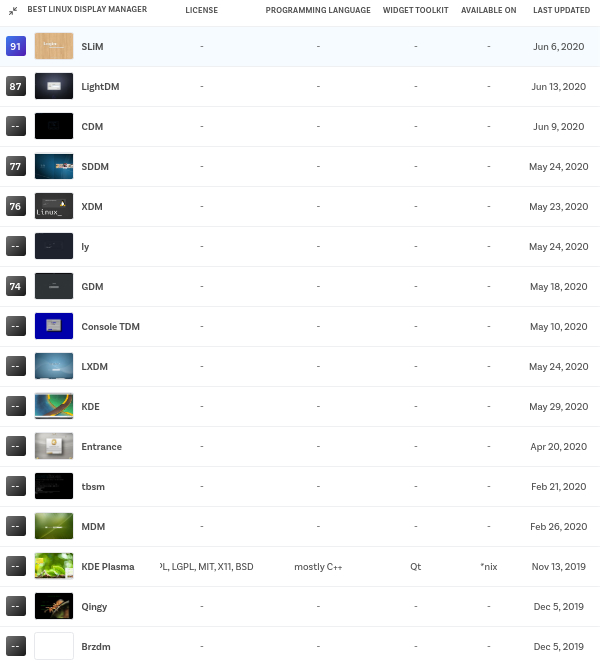
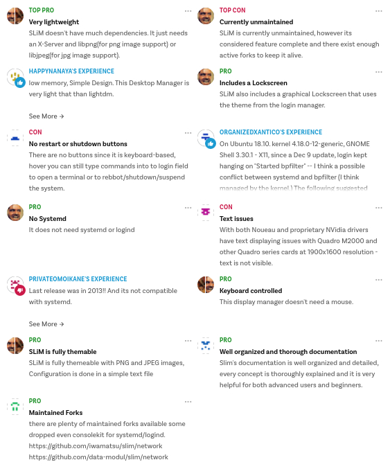
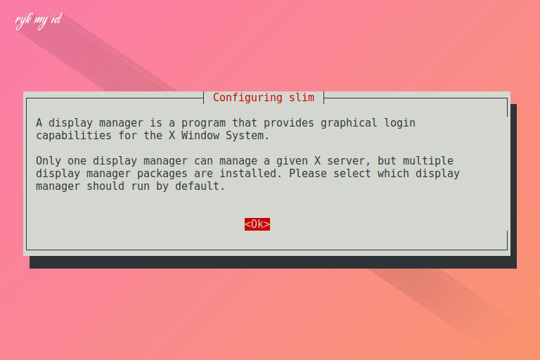
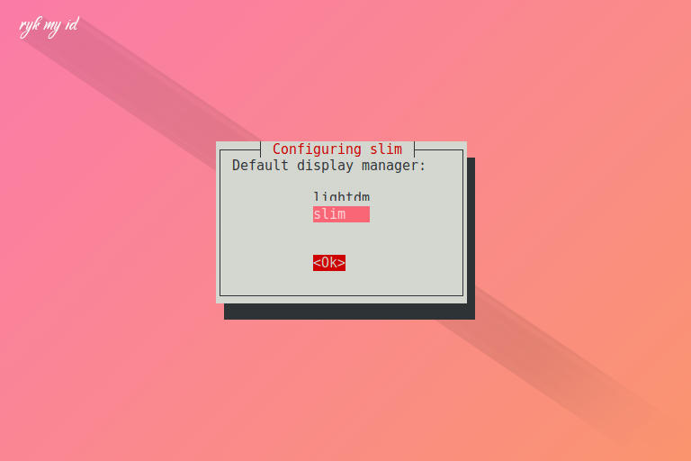

SLiM atau Simple Login Manager adalah salah satu display manager GUI untuk X Window System yang bisa dibilang sangat sederhana dan ringan. Display manager ini cocok bagi pengguna yang suka mengkustomisasi desktop menggunakan Xfce, Openbox, dan i3. Sayangnya proyek display manager ini sudah tidak dilanjutkan lagi, dan terakhir diupdate pada tahun 2013. [:(fas fa-code-branch fa-fw): GitHub Repository](https://github.com/iwamatsu/slim)


Mengutip dari halaman [Slant.co](https://www.slant.co/topics/2053/~best-linux-display-manager), SLiM menduduki peringkat nomor 1 dari hasil voting.


Berikut komentar yang diberikan mengenai kekurangan dan kelebihannya.



---

## Instalasi Paket
**:(fab fa-ubuntu fa-fw): Debian dan Ubuntu**
```bash
sudo apt install slim
```

Selanjutnya muncul dialog seperti berikut dan pilih `<Ok>` dengan menekan ( **tab** ) lalu ( **enter** ).


Kemudian muncul dialog lagi untuk mengubah default display manager, pilih slim lalu `<Ok>`.


**:(fab fa-linux fa-fw): Arch Linux**
```bash
sudo pacman -S slim
```

Jika pada distro linux debian-based otomatis muncul dialog, di Arch Linux kita perlu menghidupkannya secara manual pada systemd service. Nonaktifkan display manager yang digunakan sebelumnya, misal lightdm.
```bash
sudo systemctl disable lightdm.service
```

Kemudian aktifkan service untuk slim.
```bash
sudo systemctl enable slim.service
```

---

## Konfigurasi
Pertama, edit file <u>/etc/slim.conf</u> menggunakan text editor, misalnya nano.
```bash
sudo nano /etc/slim.conf
```

### Restart SLiM ketika Logout
SLiM secara default akan berhenti berjalan ketika pengguna logout dari desktop environment atau window manager. Untuk merestartnya, cukup hapus tanda pagar ( **#** ) pada baris <u>sessionstop_cmd</u>. Kemudian tambahkan perintah restart service seperti berikut.
```cfg
# Commands executed when starting and exiting a session.
# They can be used for registering a X11 session with
# sessreg. You can use the %user variable
#
#sessionstart_cmd        session_start
sessionstop_cmd        systemctl restart slim.service
```

### Pilihan Sessions
#### Dapat memilih
SLiM dapat memilih sessions yang dari direktori letak **xsessions** berada dengan menghapus tanda pagar ( **#** ) pada baris <u>sessiondir</u> seperti berikut.
```cfg
# Set directory that contains the xsessions.
# slim reads xsesion from this directory, and be able to select.
sessiondir            /usr/share/xsessions/
```

Kemudian buat file <u>~/.xinitrc</u> dengan langsung menggunakan text editor, misalnya nano.
```bash
nano ~/.xinitrc
```

Tambahkan perintah **exec $1**.
```cfg
# SLiM Select Sessions login command
exec $1
```

Ketika login, tekan ( **F1** ) untuk memilih sessions.

#### Tidak dapat memilih
Untuk tidak dapat memilih sessions, cukup definisikan desktop environment atau window manager kedalam file <u>~/.xinitrc</u>, misalnya **openbox-session**.
```bash
nano ~/.xinitrc
```

Definisikan desktop yang digunakan ke perintah **exec** seperti berikut.
```cfg
# Default Sessions
exec openbox-session
```

### Mengaktifkan Screenshot
Agar dapat melakukan screenshot diperlukan dependensi **imagemagick**. Kemudian atur letak direktori untuk menyimpan hasil screenshot tetapi tidak menggunakan ( **~** ) melainkan <u>/home/user/</u> seperti berikut.
```cfg
# Executed when pressing F11 (requires imagemagick)
screenshot_cmd      import -window root /home/ryk/Pictures/SLiM.png 
```

Ketika login, tekan ( **F11** ) untuk screenshot.

### Fokus ke password
Fokus ke password atau tanpa mengisi user perlu mendefinisikan default user dan mengaktifkannya pada baris <u>focus_password</u> seperti berikut.
```cfg
# default user, leave blank or remove this line
# for avoid pre-loading the username.
default_user        ryk

# Focus the password field on start when default_user is set
# Set to "yes" to enable this feature
focus_password      yes
```


Jangan pernah menggunakan superuser atau ( **root** ) sebagai default user.


### Mengubah Tema
Pertama, pilih tema yang akan digunakan. Kali ini saya menggunakan tema yang saya buat sendiri "Blue Sky" yang tampilannya seperti pada thumbnail postingan ini.


- [adi1090x/slim_themes](https://github.com/adi1090x/slim_themes)
- [pling.com/slim](https://www.pling.com/browse/cat/612/ord/rating/)
- [KeepWannabe/Great-Green](https://github.com/KeepWannabe/Great-Green)


Salin folder tema yang terdiri dari:
1. background
2. panel
3. slim.theme

Ke <u>/usr/share/slim/themes</u>. Berikut perintah lengkapnya untuk tema "Blue Sky".
```bash
wget https://github.com/owl4ce/dotfiles/raw/master/Others/bluesky.tar.xz && tar -xvf bluesky.tar.xz
sudo cp -r bluesky/ /usr/share/slim/themes/
```

Kemudian ubah temanya pada baris <u>current_theme</u> secara **default** atau **random** (jika lebih dari satu tema) menggunakan tanda koma ( **,** ) seperti berikut.
```cfg
# current theme, use comma separated list to specify a set to 
# randomly choose from
current_theme       bluesky
```

### Auto Login (Optional)
Untuk mengaktifkan otomatis login ke default user yang sudah didefinisikan, cukup hapus tanda pagar ( **#** ) pada baris <u>auto_login</u>. Kemudian ubah dari **no** ke **yes** seperti berikut.
```cfg
# Automatically login the default user (without entering
# the password. Set to "yes" to enable this feature
auto_login          yes
```

Terakhir. Jika sudah selesai mengkonfigurasi, simpan dan reboot.

## Poweroff, Reboot, Suspend, dsb
Berikut tabel username dan password yang digunakan untuk melakukan poweroff, reboot, suspend, atau membuka terminal saat login.

| Action       | Username | Password        |
|:------------:|:--------:|:---------------:|
| **Poweroff** | halt     | <root_password> |
| **Reboot**   | reboot   | <root_password> |
| **Suspend**  | suspend  | <root_password> |
| **Terminal** | console  | <root_password> |

## Lockscreen
SLiM juga termasuk slimlock yang merupakan fitur lockscreen. Untuk menggunakannya, jalankan slimlock. Misalnya pada terminal.
```bash
slimlock
``` 

## Pesan Penulis
Bagaimana cukup mudah kan?

Cukup itu yang dapat saya berikan.  
Terima kasih kepada [BanditHijo](https://bandithijo.github.io/blog/slim-display-manager-yang-sudah-ditinggalkan) karena telah mengenalkanku SLiM Display Manager. :wink:  
Referensi selengkapnya ada di [Arch Wiki](https://wiki.archlinux.org/index.php/SLiM).

Semoga bermanfaat bagi teman-teman semua.  
Terima Kasih. :grin:

